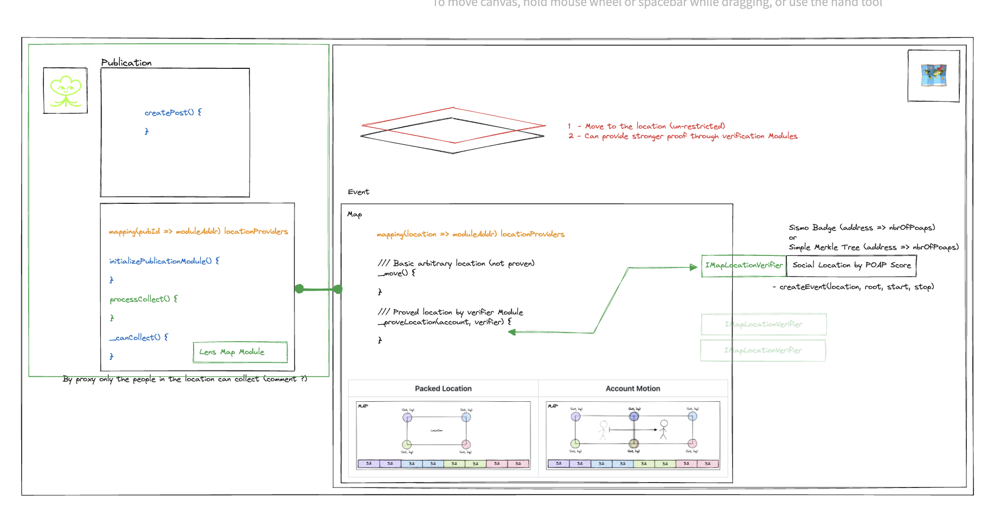

# Lens Social Proof of Location -  ETHPrague Hack

<!-- Show schema.png -->


Building on top of of a MAP in the form of a ERC1155 token [(more info)](https://github.com/nezz0746/lens-map)

Goal:

Provide a social proof of location for Lens publications to gate & encrypt content for local users.

Problem:

Movements on the map were arbitrary & unverified.

Solution:

Using a modular artitecture to allow verification of location-tokens. In this hack I built a POAPLocationVerifier in
which you can determine a time interval when you'd like to verify that addresses were in the area. On creation of the
even you provide a snapshot of POAPs in this basic format:

```json
{
        "0x225f137127d9067788314bc7fcc1f36746a3c3B5": 4,
        "0xAe46E37B5628947aC159F001a847E87452175D99": 7,
        "0xe05875F287C028901798aC2Dc8C22Ba908b8eF36": 1,
        "0x70564145fA8e8A15348EF0190e6B7c07A2120462": 1,
        "0x2B5c7025998f88550Ef2fEce8bf87935f542C190": 5,
        "0xBce6053B60C5913f4190C95F629f473BE0E379Aa": 8
}
```
*Note: Data gathered & aggregated from a group of 27 POAPs emitted @ ETHPrague 2023 & side-events is located in `/data`*
FullList: 
```js
const eventIds = "127866,127986,128345,128513,128853,128855,129109,129295,129296,129301,129335,129341,129345,129356,129380,129410,129414,129428,129432,129434,129465,129470,129477,129481,129488,129502,129616"
```


where the number is the amount of POAPs accumulated by the accound during the event. 

Assumption is that **the stronger the score the more you can trust that the account holder was present on site.**

TODO:

Was going to create a custom Lens Module to allow post creators to gate collect & encrypt their publication by location (or even better location score by providing a threshold of trust)
